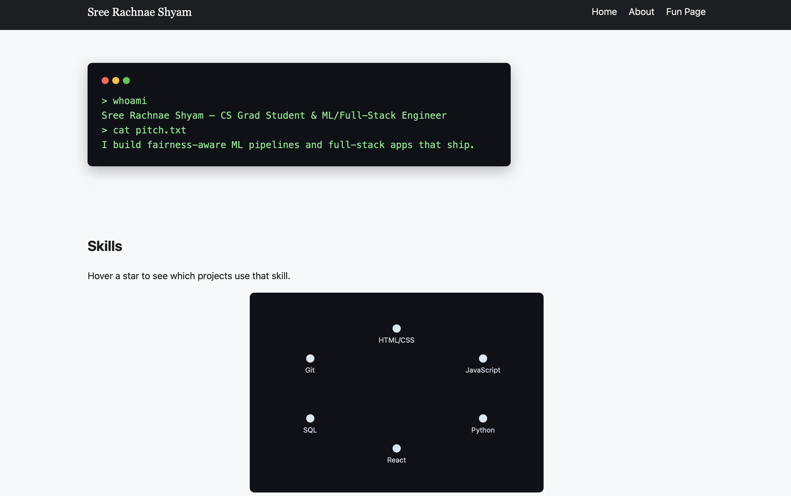

# Personal Portfolio Homepage

## Author

Sree Rachnae Shyam

## Class Link

[Link to the course page / syllabus — add your actual course URL here]

## Project Objective

A personal portfolio homepage built entirely with vanilla HTML5, CSS3, and
ES6+ JavaScript modules — no backend, no component libraries, no jQuery.
The goal is to give visitors (recruiters, classmates, collaborators) a fast,
honest overview of who I am, what I've built, and how to reach me.

The site includes four original interactive components (see "Creative
Additions" below); the final build keeps [N of them / all of them — update
once you've decided which to keep].

## Screenshot

[Add a screenshot of the homepage here once content is filled in, e.g.:]



## Instructions to Build / Run Locally

This is a fully static site — no build step or server-side code required.

1. Clone the repo:
   ```
   git clone [your-repo-url]
   cd [repo-folder]
   ```
2. Install dev dependencies (only needed for linting/formatting):
   ```
   npm install
   ```
3. Open `index.html` directly in a browser, or serve it with VS Code's
   Live Server extension for auto-reload during development.
4. To format the code:
   ```
   npm run format
   ```
5. To lint the code:
   ```
   npm run lint
   ```

## Creative Additions

Four original ES6+ components were built for this assignment:

1. **Typewriter terminal hero** (`js/typewriter.js`) — types out the intro
   text character-by-character inside a terminal-styled box.
2. **Interactive skill constellation** (`js/constellation.js`) — skills are
   plotted like stars; hovering one highlights the projects that use it.
3. **Live GitHub repo fetcher** (`js/githubRepos.js`) — fetches and renders
   the user's most recently updated public repos via the GitHub REST API.
4. **Scroll-triggered project reveal** (`js/scrollReveal.js`) — project
   cards animate into view using the native `IntersectionObserver` API.

## Folder Structure

```
/
├── index.html
├── about.html
├── ai-generated.html
├── css/
│   └── main.css
├── js/
│   ├── main.js
│   ├── typewriter.js
│   ├── constellation.js
│   ├── githubRepos.js
│   └── scrollReveal.js
├── img/
│   ├── favicon.svg
│   └── project-placeholder-*.svg
├── design/
│   ├── design-document.md
│   └── mockups/
├── package.json
├── .eslintrc.json
├── .prettierrc.json
└── LICENSE
```

## Use of GenAI Tools

This project used Claude (Anthropic) during development. Specifically:

- **Model:** Claude Sonnet 5, accessed via claude.ai
- **How it was used:**
  - Drafting the initial design document structure (personas, user
    stories, mockup wireframes) based on the assignment rubric
  - Scaffolding the HTML/CSS/JS file structure and the four ES6 module
    prototypes (typewriter effect, skill constellation, GitHub repo
    fetcher, scroll reveal)
  - Generating the content of `ai-generated.html`, as required by the
    assignment to include one AI-generated page
  - Debugging deployment issues (GitHub Pages folder structure, local
    Live Server path issues)
- **What was NOT AI-generated:** All personal bio content, the specific
  project descriptions and technologies listed on the homepage, my
  actual GitHub username/contact links, and the final decision on which
  of the four creative additions to keep were written/decided by me.
- **Example prompt used:** "Implement a personal homepage using vanilla
  HTML5, CSS3, and ES6+ modules, with a creative addition that
  differentiates it from a typical homepage — e.g. a honeycomb grid of
  project images. Build a design document first (project description,
  personas, user stories, mockups), then scaffold the site."

## License

MIT — see [LICENSE](./LICENSE)
